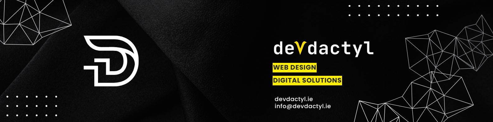

# Hello! I'm Kim

**Software Developer & Founder of Devdactyl** | Former Marine Conservation Specialist & Dive Instructor

I spent years navigating underwater environments and protecting marine ecosystems before transitioning into software development. Turns out, the problem-solving skills and attention to detail from technical diving translate surprisingly well to debugging code and architecting systems.

Currently focused on full-stack development with a particular interest in cloud platforms and scalable solutions. I enjoy building applications that solve real problems, and I'm always curious about how technology can contribute to environmental conservation efforts.

---

## Featured Projects

---

## Hackathons

Participated in dozens of hackathons covering front-end, back-end, and full-stack development. Recent projects include:

- **AI Integration**: JobSeeker app with Google Gemini AI
- **Conservation Tech**: Beach cleanup organizing app for marine conservation
- **Team Leadership**: Scrum Master roles across multiple teams
- **Themed Projects**: Women in Tech retro IDE app, retro video games

---

## Tech Stack

**Languages & Frameworks**
- Python, JavaScript (ES6+), HTML5, CSS3
- Django, Node.js, React
- Bootstrap, Tailwind CSS

**Cloud & Infrastructure**
- AWS, Microsoft Azure
- Docker, Heroku, Railway
- PostgreSQL, MongoDB, Redis
- Supabase, Neon

**Tools & Workflow**
- Git/GitHub, VS Code
- Postman, Figma
- Cloudinary, Prisma

---

## GitHub Stats

---

## Currently

- Running Devdactyl, my development consultancy 
- Building an Irish music ecommerce site for my 92-year-old grandad (React + Prisma) - helping him transition from 40 years of physical sales to digital
- Creating a raffle competition site, licencing pending
- Exploring microservices architecture
- Contributing to environmental tech projects
- Learning advanced AWS services

## Background

Before coding, I worked in marine conservation and taught scuba diving. I've logged thousands of technical dives, managed underwater research projects, and trained divers across six continents. That career taught me how to stay calm under pressure, pay attention to critical details, and solve complex problems systematically - skills that happen to be pretty useful in software development too.

The transition from ocean depths to code depths has been surprisingly natural. Both environments require precision, planning, and the ability to troubleshoot when things don't go as expected.

---

## Let's Connect

Interested in discussing development projects, cloud computing, or the intersection of technology and conservation? Feel free to reach out.

---

